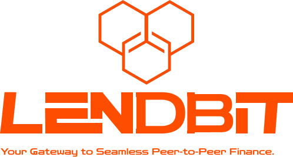

<h1 align="center">LendBit Protocol Bot For Health Factor Monitoring and Liquidation</h1>

<p align="center">
  
</p>

## **Overview**

This is a bot contract that automates the monitoring of borrowers' health factors and triggers liquidation when their health factors fall below a set threshold (e.g., 85%). The bot integrates with **Gelato** to automate the execution of liquidations, ensuring timely and efficient repayment of under-collateralized loans.

## **Table of Contents**
- [**Overview**](#overview)
- [**Table of Contents**](#table-of-contents)
- [**Features**](#features)
- [**How It Works**](#how-it-works)
  - [**Health Factor Calculation**](#health-factor-calculation)
  - [**Liquidation Process**](#liquidation-process)
- [**Installation**](#installation)
  - [**Setup Instructions**](#setup-instructions)
- [**Usage**](#usage)
  - [**Running the Bot**](#running-the-bot)
  - [**Interacting with Gelato**](#interacting-with-gelato)
  - [**Support**](#support)

## **Features**

- **Automated Health Factor Monitoring**: The bot continuously monitors the health factor of each borrower's loan/request in real-time using live price data from oracles.
- **Dynamic Liquidation Threshold**: Triggers liquidation when a borrower's health factor falls below the defined threshold (e.g., 85%).
- **Gelato Integration**: Utilizes **Gelato** to automate the liquidation process, making it easy for liquidators to execute liquidations without manual intervention.
- **Supports Multiple Collateral Tokens**: Dynamically calculates the total collateral value based on multiple tokens and fetches real-time prices from the protocol contract.

## **How It Works**

### **Health Factor Calculation**

The **health factor (HF)** is calculated to determine the safety of a loan. The formula is:

\[
\text{HF} = \frac{\text{Collateral Value} \times \text{Liquidation Threshold}}{\text{Loan Repayment}}
\]

- **Collateral Value**: The total value of all tokens deposited as collateral.
- **Liquidation Threshold**: The percentage at which a loan becomes eligible for liquidation (e.g., 85%).
- **Loan Amount**: The total amount borrowed by the borrower.

If the health factor falls below 1, the loan is under-collateralized, and liquidation is triggered.

### **Liquidation Process**

1. The bot monitors each loan’s health factor based on real-time price feeds from oracles.
2. When the health factor falls below the liquidation threshold, the bot prepares an **execution payload**.
3. The payload is sent to **Gelato**, which automates the liquidation process by repaying a portion of the loan on behalf of the borrower in exchange for the liquidated collateral.

## **Installation**

### **Setup Instructions**

1. Clone the repository:
    ```bash
    git clone https://github.com/LendBit-p2p/LendBit-Automate-Checker.git
    cd LendBit-Automate-Checker
    ```

2. Install dependencies:
    ```bash
    forge install/npm install
    ```


## **Usage**

### **Running the Bot**

After setting up, deploy the bot to any of the evm chains supported by gelato.

The bot will:
- Monitor all active loans.
- Recalculate the health factor for each loan using real-time price data.
- Trigger liquidation when necessary by sending the execution payload to Gelato.

### **Interacting with Gelato**

The bot interacts with **Gelato** to automate liquidations. The payload includes:
- **Loan/Request ID**: The unique identifier for the loan being monitored.

For detailed instructions on integrating with Gelato, refer to their [official documentation](https://docs.gelato.network/).

### **Support**
If you encounter issues or need assistance, feel free to reach out:

- Email: [support@lendbit.com](mailto://support@lendbit.com)
- Community: [Join our Discord](https://discord.com/invite/lendbit)

